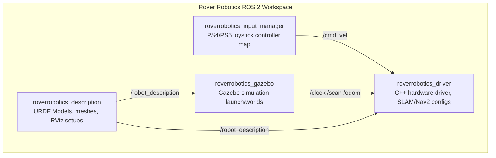
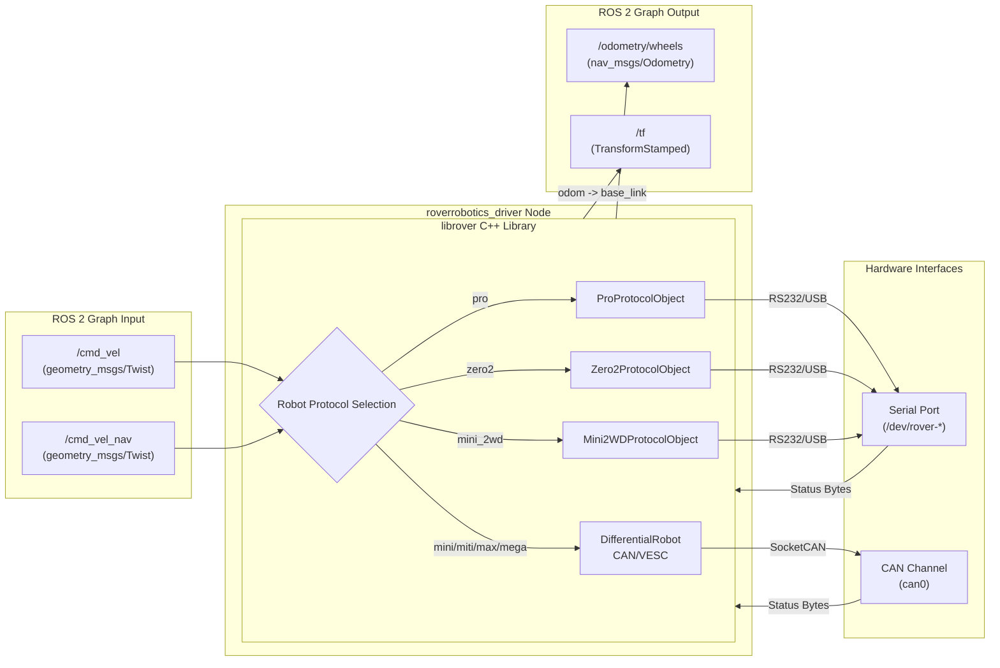
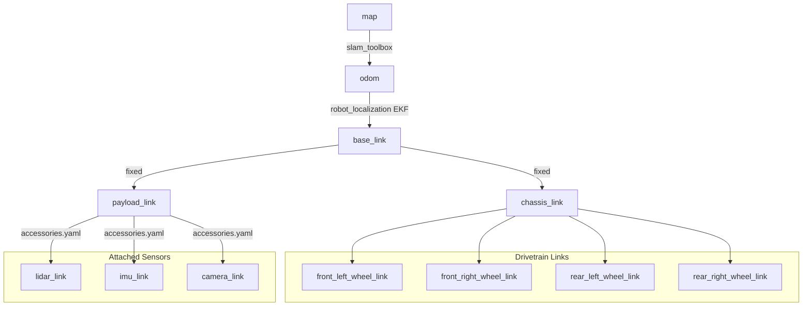

# Workspace & Node Architecture — roverrobotics_ros2

This document provides a technical overview of the workspace structure, node data flow, and coordinate frames (TF) used in the Rover Robotics ROS 2 Driver Stack.

---

## 1. Workspace Packages Overview

The workspace consists of 4 focused ROS 2 packages rather than a monolithic application:

| Package Name | Path | Role |
| :--- | :--- | :--- |
| **`roverrobotics_driver`** | [`roverrobotics_driver/`](file:///Users/aman.gupta/Documents/GitHub/roverrobotics_ros2/roverrobotics_driver) | C++ nodes interfacing with physical hardware via CAN/Serial, loading per-robot parameters, EKF localization, and launching SLAM/Nav2. |
| **`roverrobotics_description`** | [`roverrobotics_description/`](file:///Users/aman.gupta/Documents/GitHub/roverrobotics_ros2/roverrobotics_description) | Houses 2WD/4WD/Flipper robot descriptions (URDF/Xacro), payload mounting links, sensor offset definitions, and 3D visual/collision meshes (`.dae`). |
| **`roverrobotics_gazebo`** | [`roverrobotics_gazebo/`](file:///Users/aman.gupta/Documents/GitHub/roverrobotics_ros2/roverrobotics_gazebo) | Integration folders with Gazebo simulator world definitions, plugins for differential and skid-steer drive simulation, and simulated sensor spawners. |
| **`roverrobotics_input_manager`** | [`roverrobotics_input_manager/`](file:///Users/aman.gupta/Documents/GitHub/roverrobotics_ros2/roverrobotics_input_manager) | Maps joystick hardware axes and buttons (DS4/DS5) into standardized velocity commands (`geometry_msgs/msg/Twist`). |

---

## 2. Driver Node Data Flow

The `roverrobotics_driver` node acts as a bridge between the ROS 2 computational graph and the physical robot controller (VESC/serial board/CAN channel).

---

## 3. Coordinate Frame (TF) Tree

A standard configuration provides coordinate frames starting from the navigation map down to individual sensor links.

*   **`map` $\rightarrow$ `odom`**: Handled by localization/mapping nodes such as `slam_toolbox`.
*   **`odom` $\rightarrow$ `base_link`**: Broadcast by `robot_state_publisher` using wheel odometry fused with IMU (via `robot_localization` EKF nodes).
*   **`base_link` $\rightarrow$ `chassis_link` / `payload_link`**: Static transforms set by the robot’s URDF xacro configurations inside the `roverrobotics_description` package.
*   **`payload_link` $\rightarrow$ Sensors**: Custom configurations set up using `accessories.launch.py` and parameters from `accessories.yaml`.
