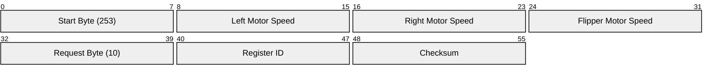

# Hardware Communication Protocols — roverrobotics_ros2

This document details the serial and CAN bus protocols used by the `librover` driver library to interface with various Rover Robotics physical bases.

---

## 1. Protocol Architecture Mapping

Depending on the `robot_type` specified in your YAML configurations, the driver instantiates a specific protocol handler class derived from `BaseProtocolObject`:

```mermaid
graph TD
    Config[Robot Config YAML] -->|robot_type parameter| Factory[Protocol Selection]
    
    Factory -->|pro| Pro[ProProtocolObject]
    Factory -->|zero2| Zero2[Zero2ProtocolObject]
    Factory -->|mini_2wd| Mini2WD[Mini2WDProtocolObject]
    Factory -->|mini / miti / max / mega| Diff[DifferentialRobot]

    Pro -->|Serial @ 57600 baud| RS232_1[/dev/rover-pro]
    Zero2 -->|Serial @ 115200 baud| RS232_2[/dev/rover-zero2]
    Mini2WD -->|Serial @ 115200 baud| RS232_3[/dev/rover-mini2wd]
    Diff -->|SocketCAN| CAN0[can0]
    Diff -->|Serial VESC bridge| RS232_4[/dev/rover-vesc]
```

---

## 2. Rover Pro Serial Protocol (57,600 Baud)

The Rover Pro runs a custom serial protocol communicating over a 57,600 baud channel.

### 2.1 Command Packet Structure (Command Sent to Robot)

Packets sent from the host computer to the Rover Pro are **7 bytes** in length:

| Byte Index | Field | Data Type | Description |
| :--- | :--- | :--- | :--- |
| `0` | Start Byte | `uint8_t` | Constant `253` (`0xFD`) |
| `1` | Left Motor Speed | `uint8_t` | Command value scaled from `0` to `250` (Neutral = `125`) |
| `2` | Right Motor Speed | `uint8_t` | Command value scaled from `0` to `250` (Neutral = `125`) |
| `3` | Flipper Motor Speed | `uint8_t` | Command value scaled from `0` to `250` (Neutral = `125`) |
| `4` | Request Byte | `uint8_t` | Constant `10` (`0x0A`) |
| `5` | Register ID | `uint8_t` | The hardware register being queried (e.g. current, voltage, temp) |
| `6` | Checksum | `uint8_t` | Calculated as: `255 - (LeftMotor + RightMotor + FlipperMotor + RequestByte + RegisterID) % 255` |



### 2.2 Response Packet Structure (Received from Robot)

Packets received from the Rover Pro are **5 bytes** in length:

| Byte Index | Field | Data Type | Description |
| :--- | :--- | :--- | :--- |
| `0` | Start Byte | `uint8_t` | Constant `253` (`0xFD`) |
| `1` | Register ID | `uint8_t` | Matches the Register ID queried in the command |
| `2` | Data High | `uint8_t` | MSB of the queried 16-bit register value |
| `3` | Data Low | `uint8_t` | LSB of the queried 16-bit register value |
| `4` | Checksum | `uint8_t` | Calculated as: `255 - (RegisterID + DataHigh + DataLow) % 255` |

---

## 3. DifferentialRobot Protocol (SocketCAN & VESC Bridge)

Robots like the Max, Mega, Mini, and Miti utilize motor controllers (typically VESC-based) managed by the `DifferentialRobot` driver class. Communication occurs either via SocketCAN (`can0`) or a serial-to-CAN bridging controller.

### 3.1 SocketCAN Frame Layout

Each motor controller on the bus is assigned a unique node ID matching its physical position:
*   **Node 1**: Front Left
*   **Node 2**: Front Right
*   **Node 3**: Rear Left
*   **Node 4**: Rear Right

Commands are sent as standard CAN frames targeting duty cycle or current control depending on target velocities.

### 3.2 VESC Serial Bridge Packet (115,200 Baud)

When configured with `comm_type: serial` on VESC-based robots, the host communicates using encapsulated VESC packet frames:

| Field | Size (Bytes) | Value / Details |
| :--- | :--- | :--- |
| **Payload Header** | 1 | Constant `2` (`PAYLOAD_BYTE_SIZE_`) |
| **Payload Size** | 1 | Number of bytes in payload (e.g. `1`, `3`, `5`, or `7`) |
| **Payload Data** | Variable | Command payload (see below) |
| **CRC16 (High)** | 1 | MSB of CRC-16 (x16 + x12 + x5 + 1) |
| **CRC16 (Low)** | 1 | LSB of CRC-16 |
| **Stop Byte** | 1 | Constant `3` (`STOP_BYTE_`) |

#### Payload Data Varieties:
*   **Read Status Command:**
    *   Payload: `[COMM_GET_VALUES]` (1 byte)
*   **Forwarded Read Status Command (via CAN Bridge to VESC Node ID):**
    *   Payload: `[COMM_CAN_FORWARD, VESC_ID, COMM_GET_VALUES]` (3 bytes)
*   **Direct Duty Cycle Command:**
    *   Payload: `[COMM_SET_DUTY, D3, D2, D1, D0]` (5 bytes, representing 32-bit integer duty cycle value scaled by `100,000.0`)
*   **Forwarded Duty Cycle Command (via CAN Bridge):**
    *   Payload: `[COMM_CAN_FORWARD, VESC_ID, COMM_SET_DUTY, D3, D2, D1, D0]` (7 bytes)

---

## 4. Case Study: 2WD Mini (Serial) vs Miti (Direct CAN)

To clarify how commands traverse physical channels, let's trace a forward movement command (`linear.x = 0.5 m/s`) for both platforms.

### 4.1 Kinematics & Duty Cycle Conversion
1. The driver processes the velocity command and computes motor duty cycles:
   $$\text{Left Duty} = 0.40, \quad \text{Right Duty} = 0.40$$
2. The duty values are scaled:
   $$0.40 \times 100,000.0 = 40,000 \quad (\text{Hex: } \mathtt{0x00009C40})$$
3. In big-endian format, this becomes: `[0x00, 0x00, 0x9C, 0x40]`.

---

### 4.2 2WD Mini Serial Byte Stream

*   **Drivetrain Setup:** Left Motor (VESC ID 1, Master over USB), Right Motor (VESC ID 8, Slave over CAN).
*   **Topology:**
    ```mermaid
    graph LR
        PC[Host PC] -->|UART USB /dev/rover-control| VESC1[VESC ID 1<br/>Master]
        VESC1 -->|Internal CAN Bus| VESC8[VESC ID 8<br/>Slave]
        VESC1 --> M1[Left Motor]
        VESC8 --> M2[Right Motor]
    ```

#### Packet A: Left Motor (Direct commands to USB VESC)
Sent directly via `write()` on `/dev/rover-control`:
```
Byte:  [0]  [1]  [2]  [3]    [4]    [5]    [6]    [7]     [8]     [9]
       ┌──┬──┬──┬────────┬────────┬────────┬────────┬───────┬───────┬──┐
       │02│05│05│  0x00  │  0x00  │  0x9C  │  0x40  │ CRC-H │ CRC-L │03│
       └──┴──┴──┴────────┴────────┴────────┴────────┴───────┴───────┴──┘
        │  │  │  └──────────── Duty Value (40,000) ───────────┘    │
        │  │  └─ COMM_SET_DUTY (5)                                 └─ STOP_BYTE (3)
        │  └─ Payload Length (5)
        └─ START_BYTE (2)
```

#### Packet B: Right Motor (Wrapped for CAN Forwarding to ID 8)
Sent to the Master VESC, which extracts the payload and forwards it across the internal CAN bus to VESC ID 8:
```
Byte:  [0]  [1]  [2]   [3]  [4]  [5]    [6]    [7]    [8]     [9]     [10]    [11]
       ┌──┬──┬───┬───┬──┬────────┬────────┬────────┬───────┬───────┬──┐
       │02│07│22 │08 │05│  0x00  │  0x00  │  0x9C  │ 0x40  │ CRC-H │ CRC-L │03│
       └──┴──┴───┴───┴──┴────────┴────────┴────────┴───────┴───────┴──┘
        │  │  │   │   │  └──────── Duty Value (40,000) ───────────┘
        │  │  │   │   └─ COMM_SET_DUTY (5)
        │  │  │   └─ Target VESC ID (8)
        │  │  └─ COMM_CAN_FORWARD (34 / 0x22)
        │  └─ Payload Length (7)
        └─ START_BYTE (2)
```

---

### 4.3 Miti Direct CAN Frame Layout

*   **Drivetrain Setup:** Front-Left (ID 1), Front-Right (ID 2), Back-Left (ID 3), Back-Right (ID 4).
*   **Topology:**
    ```mermaid
    graph LR
        PC[Host PC] -->|CAN-to-USB Adapter| BUS[CAN Bus]
        BUS --> VESC1[VESC ID 1]
        BUS --> VESC2[VESC ID 2]
        BUS --> VESC3[VESC ID 3]
        BUS --> VESC4[VESC ID 4]
    ```

Instead of UART envelopes, direct SocketCAN frames are broadcast on the bus.
*   **CAN ID Construction:** VESC base offset + Node ID. For Duty Cycle commands, the mask is `0x80000000`. Thus, VESC ID 1 uses:
    $$\mathtt{0x80000000} \mid 1 = \mathtt{0x80000001}$$

Each motor receives its frame directly on `can0` without forwarding:

```
CAN ID      = 0x80000001
CAN DLC     = 4 bytes
Data Bytes  = [0x00, 0x00, 0x9C, 0x40]
```

---

## 5. Serial (UART) vs Direct CAN: Trade-offs

| Criterion | UART Serial (PC ➔ Gateway VESC) | Direct CAN Bus (PC ➔ SocketCAN) |
| :--- | :--- | :--- |
| **Wiring & Setup** | **Simple:** Plug-and-play USB connection, standard serial TTY ports. | **Complex:** Requires CAN adapter, termination resistors (120Ω), bus topology constraints. |
| **Latency & Jitter** | **Higher:** Gateway VESC must receive, unwrap, and forward command packets. | **Minimal:** Direct broadcast frames trigger motor stages simultaneously. |
| **Arbitration & Sync** | **None:** Point-to-point serial communication; master handles timing. | **Native:** Hardware prioritizes collision avoidance and simultaneous wheel command execution. |
| **Fault Tolerance** | **Single Point:** Failure in Master VESC or USB cable cuts communication to all motors. | **Robust:** Failure of one motor VESC does not affect the rest of the CAN bus. |
| **Scale Limits** | **Poor:** Funneling multiple motor states and sensor feeds limits maximum loop frequency. | **Excellent:** Designed to support dozens of high-frequency nodes (BMS, IMU, motors). |

