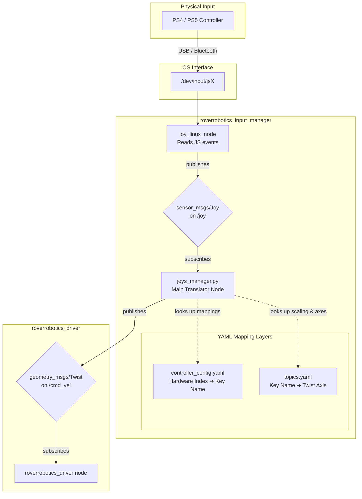
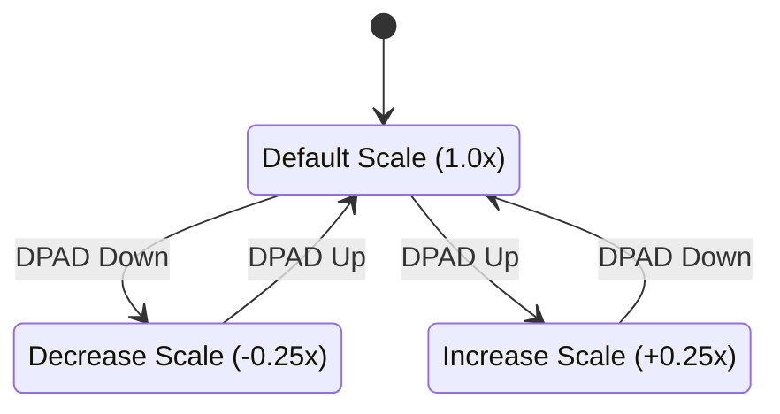

# Joystick Teleop & Input Flow — roverrobotics_ros2

This document details how gamepad input is read, mapped, and translated into ROS 2 velocity commands (`geometry_msgs/msg/Twist`) to drive the physical or simulated robots.

For the full **rqt_graph** node/topic view when teleop is started with `ros2 launch roverrobotics_driver mini_2wd_teleop.launch.py`, see [architecture.md — §4 ROS Graph: mini_2wd teleop](architecture.md#4-ros-graph--mini_2wd_teleoplaunchpy).

---

## 1. Input Flow Architecture

The teleop control loop consists of three main stages: physical reading, config-driven translation, and ROS 2 topic publishing.



---

## 2. Configuration Mappings

The translation from button presses and joystick deflections to actual speed uses a two-stage abstraction. This allows the same control configuration to work across different physical controllers by simply swapping the hardware-specific layout file.

### Stage 1: Hardware-to-Key Translation
Layout files such as [`ps4_controller_config.yaml`](file:///Users/aman.gupta/Documents/GitHub/roverrobotics_ros2/roverrobotics_driver/config/ps4_controller_config.yaml) map raw joystick indices to readable string names:

```yaml
LEFT_JOY_VERT:
  type: axis
  index: 1
  exclusion: [-0.15, 0.15] # Deadzone filtering
  scale: 1.25              # Hardware-level gain
  offset: 0
```

### Stage 2: Key-to-Twist Translation
The [`topics.yaml`](file:///Users/aman.gupta/Documents/GitHub/roverrobotics_ros2/roverrobotics_driver/config/topics.yaml) config file maps the readable string names to Twist components:

```yaml
joy_manager:
  topic: /cmd_vel
  type: Twist
  data:
    linear:
      x: LEFT_JOY_VERT
      y: 0
      z: 0
    angular:
      x: 0
      y: RIGHT_JOY_VERT
      z: RIGHT_JOY_HORIZ
```

---

## 3. Dynamic Scaling (Throttle & Turbo)

In addition to static scaling, the `joys_manager` implements a dynamic throttle system, allowing operators to scale the robot's maximum velocity on the fly.



*   **Dynamic Throttle Mappings:**
    *   **Linear Scale:** Controlled by the DPAD vertical axis (`DPAD_VERT`). Each tick adjusts the scale by `lin_increment: 0.25`.
    *   **Angular Scale:** Controlled by the DPAD horizontal axis (`DPAD_HORIZ`). Each tick adjusts the scale by `ang_increment: 0.25`.
*   **Deadzone Filtering (`exclusion`):** 
    *   Joysticks filter out small deflections (e.g. `[-0.15, 0.15]`) to prevent motor "humming" or slow drift when sticks do not center perfectly.
