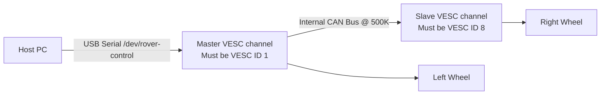

# Installation Sequence & Hardware Configuration — roverrobotics_ros2

This document provides step-by-step instructions for bringing up the software environment on your host PC/Jetson Orin, configuring udev rules, and adjusting on-board motor controller settings (VESC IDs) for dual-channel operations.

---

## 1. ROS 2 Workspace Installation Sequence

Setting up the stack requires a specific order of execution. **ROS 2 must be installed and sourced natively before setting up the Rover workspace.** Running the scripts out of order will cause missing package errors and build failures.

```mermaid
chronology
    title Workspace Provisioning Sequence
    2026-05-23 : Step 1: Install ROS 2 Base <br/> Run ros2_installation.sh to set up apt sources & download desktop/base packages.
    2026-05-23 : Step 2: Source ROS Environment <br/> Source /opt/ros/distro/setup.bash to make colcon & ROS packages visible in terminal.
    2026-05-23 : Step 3: Run setup_rover.sh <br/> Installs ROS package dependencies, clones bno055/rplidar, and builds the workspace.
```

### Step 1: Install ROS 2 Base
Run the base installation script from the installation repository:
```bash
cd rover_install_scripts_ros2
chmod +x ros2_installation.sh
./ros2_installation.sh
```
*Note: Select **Humble** (on Ubuntu 22.04) and **Desktop** (to include visualization tools like RViz).*

### Step 2: Source base ROS 2 environment
Ensure that the active terminal sees the newly installed packages:
```bash
source /opt/ros/humble/setup.bash
```

### Step 3: Run Rover Setup Script
```bash
chmod +x setup_rover.sh
./setup_rover.sh
```
*Prompt Choices for Jetson Orin:*
*   When asked `Are you using x86-based NVIDIA computer?`, answer **No** (this retains the ARM/Jetson PS4 controller configurations instead of swapping them for x86 JetPack 6 defaults).

---

## 2. On-Board VESC ID Configuration (2WD Mini Case Study)

The 2WD Mini uses a single physical USB cable to communicate with a **Dual VESC** speed controller (e.g. Flipsky Dual FSESC). Runtime operations expect a **Master/Slave** relationship over an internal CAN link on the controller board.



### The Problem with Default IDs
By default, dual VESC boards often ship with IDs like `67` and `83` (or `0` and `1`). 
*   Because the `roverrobotics_driver` sends linear velocity directly to ID `1` over serial, the left wheel may spin.
*   However, the right wheel remains dead because commands wrapped in `COMM_CAN_FORWARD` target ID `8`—which is ignored by a slave controller set to ID `83`.

### Step-by-Step VESC Tool Correction
To resolve this, you must adjust the VESC configurations using the **VESC Tool**:

1. **Connect to Master:** Plug the USB cable into the port corresponding to the master VESC. Open the VESC Tool, select `/dev/cu.usbmodem*` (on macOS) or `/dev/ttyACM*` (on Linux), and click **Connect**.
2. **Scan CAN Devices:** In the bottom-left corner of the window, click **Scan CAN**. You should see two devices appear in the **CAN-Devices** list (e.g., `local` and a remote CAN address like `83`).
3. **Configure Master VESC:**
   * Click **VESC local** in the CAN-Devices list.
   * Navigate to **App Settings ➔ General ➔ VESC ID**.
   * Change the value to **`1`**.
   * Click **Write Configuration** (located at the bottom-right corner or bottom toolbar).
4. **Configure Slave VESC:**
   * Click the other VESC in the CAN-Devices list (e.g., the device showing `83`).
   * Navigate to **App Settings ➔ General ➔ VESC ID**.
   * Change the value to **`8`**.
   * Click **Write Configuration**.
5. **Cycle Power:** Turn the robot completely off, wait 10 seconds, and turn it back on. Reconnect in VESC Tool and run a CAN Scan to confirm the active IDs are now **`1`** and **`8`**.
